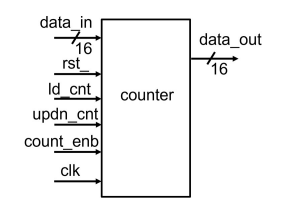
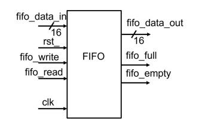
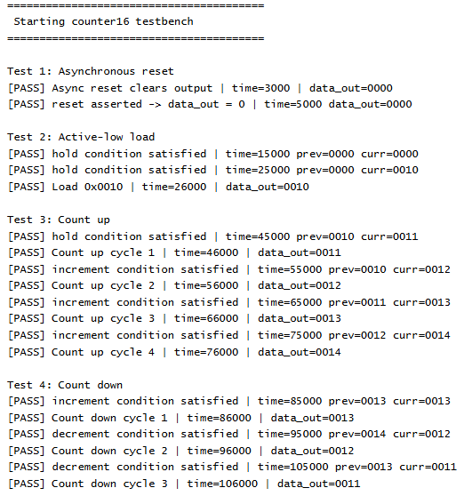
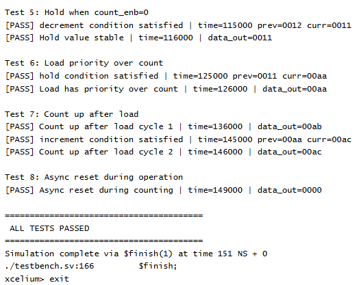
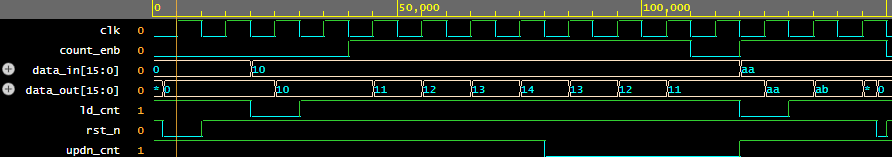
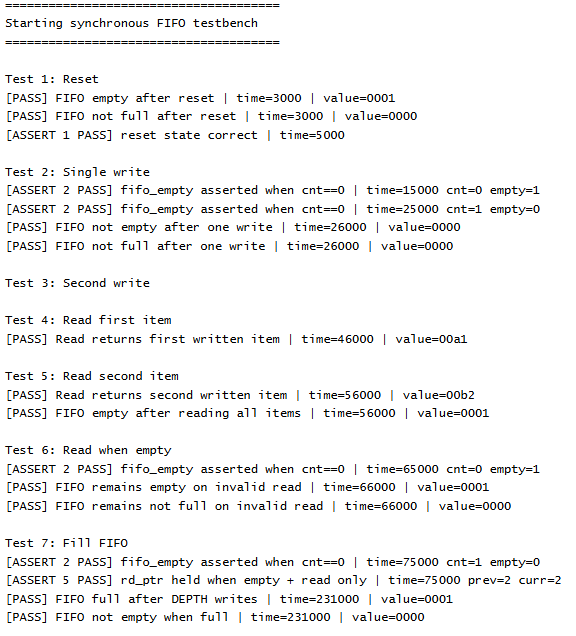
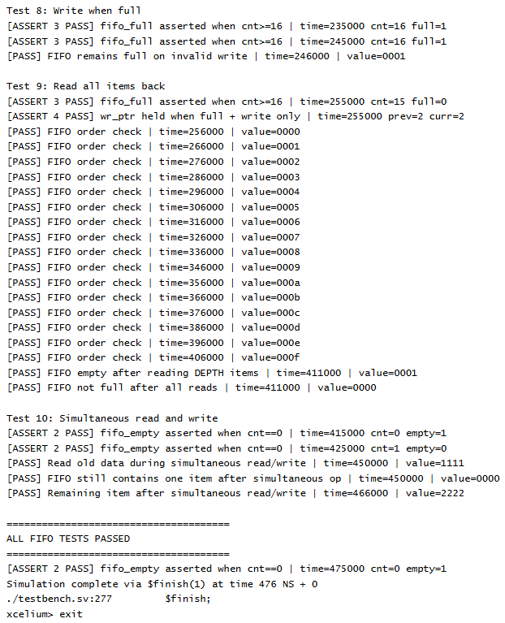

# Design and Verification of an Up and Down Counter Counter and synchronous FIFO in System Verilog

The goal of this project is to design with SystemVerilog and verify with a testbench and SVA two different circuits.

For each circuit, the project includes producing the SystemVerilog code, testing the code correctness through a testbench and verifying the correct functionality of the circuit with SVA.

```text
project/
├── rtl/
│   ├── counter16.sv
│   └── FIFO.sv
├── tb/
│   ├── testbench_counter.sv
│   └── testbench_FIFO.sv
├── sva/
│   ├── counter16_property.sv
│   └── FIFO_property.sv
├── images/
│   ├── counter_block_diagram.png
│   ├── fifo_block_diagram.png
│   ├── counter_simulation_results_1.png
│   ├── counter_simulation_results_2.png
│   ├── counter_waveform.png
│   ├── fifo_simulation_results_1.png
│   └── fifo_simulation_results_2.png
└── README.md
```

## Top Modules (`counter16.sv` & `FIFO.sv`)

The first circuit is a basic 16-bit counter that either increments or decrements on every active clock edge. The top-level block diagram is shown below.

, where all input and output signals are defined. These signals are used as the ports of the top-level design module. 

The counter specifications are:

- The counter uses 16-bit input and output data.
- When `ld_cnt` is asserted low, the input data is loaded and driven to the output.
- When `count_enb` is asserted high:

  - if `updn_cnt` is high, the counter counts upward.
  - if `updn_cnt` is low, the counter counts downward.
- When `count_enb` is low, the counter keeps its current output value unchanged.
- The load operation has priority over the count enable operation.
- The counter is triggered on the positive edge of the clock and includes an asynchronous active-low reset.

The second circuit is a simple synchronous FIFO with parameterized width and depth. In this implementation, both the width and depth are set to 16. The block diagram of the circuit is shown below, where all input and output signals are presented. 



The FIFO memory specifications are:

- The memory behavior is controlled by a write pointer and a read pointer, named wr_ptr and rd_ptr.
- The write pointer increments by 1 whenever a write request occurs and the FIFO is not full.
- The read pointer increments by 1 whenever a read request occurs and the FIFO is not empty.
- The memory includes one internal counter, `cnt`, which increments on a write operation and decrements on a read operation. This counter is used to indicate the following conditions:
  - When the FIFO is full, `fifo_full` is asserted.
  - When the FIFO is empty, `fifo_empty` is asserted.
  - Both condition signals are active high.
- The FIFO operates on the positive edge of the clock and includes an asynchronous active-low reset.

## SVA Properties (`counter16_property.sv` & `FIFO_property.sv`)

The verification uses concurrent SystemVerilog Assertions, defined with property/endproperty and checked using assert property, to monitor the counter behavior on clock edges. For the counter SVA, $past() is used on the control signals to check the values that caused the current counter output update, to avoid false failures caused by testbench timing.

For the counter the following cases are verified using SVA:

1. When reset is asserted, the counter output becomes zero.
2. If `ld_cnt` is deasserted and `count_enb` is not active, the counter output remains unchanged. This property should be disabled while reset is active low.
3. If `ld_cnt` is deasserted and `count_enb` is active, then the counter increments when `updn_cnt` is high and decrements when `updn_cnt` is low. This property is also disabled while reset is active low.

For the FIFO the following scenarios are verified using SVA:

1. During reset, the read pointer and write pointer are zero, the empty flag is asserted, the full flag is deasserted, and the internal counter is also zero.
2. The `fifo_empty` signal is asserted whenever `cnt` is equal to zero. This property is disabled while reset is active.
3. The `fifo_full` signal is asserted whenever `cnt` is greater than or equal to 16. This property is disabled while reset is active.
4. If the FIFO is full and a write request occurs without a read request, the write pointer remains unchanged.
5. If the FIFO is empty and a read request occurs without a write request, the read pointer remains unchanged.

## Testbenches (`testbench_counter.sv` & `testbench_FIFO.sv`)

The testbenches are used to simulate both circuits and check their behavior using test cases. Each testbench instantiates the corresponding DUT, applies input stimulus, compares the actual output with the expected output, and prints pass or fail messages during simulation.

For the counter, the following cases are tested:

1. Asynchronous reset clears the counter output.
2. Active-low load correctly loads `data_in` into `data_out`.
3. The counter increments when `count_enb` is high and `updn_cnt` is high.
4. The counter decrements when `count_enb` is high and `updn_cnt` is low.
5. The counter holds its value when `count_enb` is low.
6. The load operation has priority over counting.
7. The counter continues counting correctly after a load operation.
8. Asynchronous reset works correctly during operation.

The counter simulation results and waveform are shown below.

<p align="center">
  
  
</p>



For the FIFO, the following cases are tested:

1. Reset sets the FIFO to the empty state.
2. A single write stores data and makes the FIFO not empty.
3. A second write stores another data value.
4. A read operation returns the first written item.
5. A second read returns the second written item and makes the FIFO empty.
6. A read request while empty does not change the FIFO state incorrectly.
7. Writing `DEPTH` items fills the FIFO.
8. A write request while full does not change the FIFO state incorrectly.
9. Reading all stored items returns them in FIFO order.
10. Simultaneous read and write operation is tested.

The FIFO simulation results are shown below.

<p align="center">
  
  
</p>

## Notes

The designs were compiled and simulated on EDA Playground using Cadence Xcelium 25.03.

For the counter simulation, include:

- `rtl/counter16.sv`
- `tb/testbench_counter.sv`
- `sva/counter16_property.sv`

For the FIFO simulation, include:

- `rtl/FIFO.sv`
- `tb/testbench_FIFO.sv`
- `sva/FIFO_property.sv`

